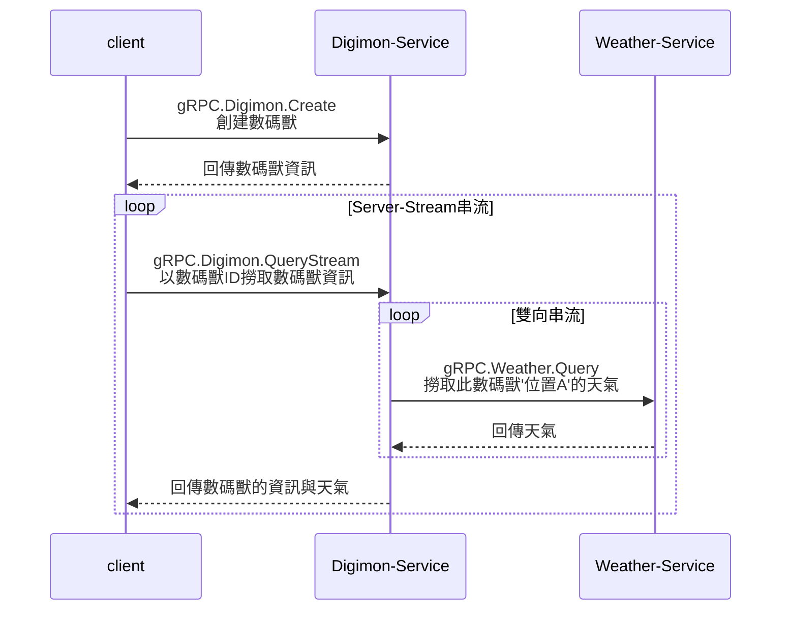

本文章同時發佈於：

- [Github(包含程式碼)](https://github.com/superj80820/2020-ithelp-contest/blob/master/DAY14)
- [Medium](https://medium.com/%E9%AB%92%E6%A1%B6%E5%AD%90/day14-%E4%BB%A5-grpc-%E5%AF%A6%E4%BD%9C%E5%85%A9%E5%80%8B%E5%BE%AE%E6%9C%8D%E5%8B%99%E7%9A%84%E6%BA%9D%E9%80%9A-283968a42d0a)
- [iT 邦幫忙](https://ithelp.ithome.com.tw/articles/10245943)

```
文章為自己的經驗與夥伴整理的內容，設計沒有標準答案，如有可以改進的地方，請告訴我，我會盡我所能的修改，謝謝大家～
```

---

大家好，在講解完 gRPC 的概念與使用後，接下來將介紹實際微服務溝通的實作，還記得[DAY07](https://github.com/superj80820/2020-ithelp-contest/blob/master/DAY07)獲得數碼獸的 Digimon-Service 嗎？

接下來要再設計一個`專門拿取天氣`的 Weather-Service，並以雙向串流提供特定`位置A`的天氣。我們假定數碼獸都在`位置A`，透過與 Weather-Service 溝通我們可以獲得數碼獸所在位置的天氣。


## 實際運作

gRPC schemas:

- [gRPC.Digimon](https://github.com/superj80820/2020-ithelp-contest/blob/master/DAY14/schemas/digimon/schema.proto)
- [gRPC.Weather](https://github.com/superj80820/2020-ithelp-contest/blob/master/DAY14/schemas/weather/schema.proto)

以下流程可以與上方 schema 做對照，會比較清楚，



要特別注意的是，[gRPC.Digimon](https://github.com/superj80820/2020-ithelp-contest/blob/master/DAY14/schemas/digimon/schema.proto)的

`rpc QueryStream (QueryRequest) returns (stream QueryResponse) {}`

為 Server-Stream，這代表 Client 端可以請求一次之後就持續收到 Server 的 Responses。

而[gRPC.Weather](https://github.com/superj80820/2020-ithelp-contest/blob/master/DAY14/schemas/weather/schema.proto)的

`rpc Query (stream QueryRequest) returns (stream QueryResponse) {}`

為雙向串流，這代表 Digimon-Service 可以一直要求不同的位置，而 Weather-Service 會把不同的位置依依回傳，並且`不會斷線`，雙方一直是長連線。

(不過位置目前只有`位置A`，沒有實作其他位置，因為沒時間 XD)

## 先 run 起來再說

先 run 起來可能會比較有感覺，請 clone [Github-Example-Code](https://github.com/superj80820/2020-ithelp-contest)，並將 Server run 起來，

```
$ cd DAY14
$ docker-compose up
```

使用 test 資料夾的`grpc.go`來創建數碼獸並使用`gRPC.Digimon.QueryStream`撈取資料，

```
$ cd go-server/test
$ go run grpc.go
```

可以看到獲取了 4 次資料，並且天氣會隨著時間有所變化，


## Weather-Service 講解


一樣使用 Clean Architecture 來設計，而在 repository 層沒有真的接上天氣相關的 API，單純以 random 的形式回傳天氣，

```golang
// Query ...
func (w *WeatherHandler) Query(srv pb.Weather_QueryServer) error {
	for {
		msg, err := srv.Recv()
		if err == io.EOF {
			return nil
		}
		if err != nil {
			logrus.Error(err)
			return err
		}

		aWeather, err := w.WeatherUsecase.GetByLocation(context.Background(), msg.GetLocation())
		if err != nil {
			logrus.Error(err)
		}

		gRPCWriterEnum, err := mappingGRPCWeatherEnum(aWeather.Weather)
		if err != nil {
			logrus.Error(err)
		}

		srv.Send(&pb.QueryResponse{
			Location: aWeather.Location,
			Weather:  gRPCWriterEnum,
		})
	}
}
```

比較要注意的地方是，由於`gRPC.Weather.Query`是雙向串流，所以實作上要透過`for{}`來模擬`while`迴圈的機制來掃描`srv.Recv()`是否有新訊息傳入，處理完傳入訊息後再透過`srv.Send()`回傳給 client 端。

## Digimon-Service 講解


在 Digimon-Service 新增了一個 weather 資料夾，值得注意的是，由於天氣的來源是 gRPC，所以我在 repository 層新增了 `grpc.go`，這是我覺得比較合理的實作，而在此層我將 gRPC 的`Weather_QueryServer`

```golang
type Weather_QueryServer interface {
	Send(*QueryResponse) error
	Recv() (*QueryRequest, error)
	grpc.ServerStream
}
```

轉換成

```golang
type StreamWeather interface {
	Send(*Weather) error
	Recv() (*Weather, error)
}
```

避免 usecase 層實際依賴`QueryResponse`與`QueryRequest`，以達到依賴反轉(DI)。

---

而在 QueryStream 的 delivery 實作上，以`位置A`讓`WeatherUsecase`產生`weatherClient`，每 5 秒撈取一次天氣，並與數碼獸的資訊一起以`srv.Send()`回傳給 client 端

```golang
// QueryStream ...
func (d *DigimonHandler) QueryStream(req *pb.QueryRequest, srv pb.Digimon_QueryStreamServer) error {
	weatherClient, err := d.WeatherUsecase.GetStreamByLocation(context.Background(), "A")
	if err != nil {
		logrus.Error(err)
		return err
	}

	for {
		if err := weatherClient.Send(&domain.Weather{
			Location: "A",
		}); err != nil {
			logrus.Error(err)
			return err
		}

		time.Sleep(time.Duration(5) * time.Second)

		aWeather, err := weatherClient.Recv()
		if err != nil {
			logrus.Error(err)
			return err
		}

		aDigimon, err := d.DigimonUsecase.GetByID(context.Background(), req.GetId())
		if err != nil {
			logrus.Error(err)
			return err
		}

		srv.Send(&pb.QueryResponse{
			Id:       aDigimon.ID,
			Name:     aDigimon.Name,
			Status:   aDigimon.Status,
			Location: aWeather.Location,
			Weather:  aWeather.Weather,
		})
	}
}
```

---

謝謝你的閱讀～
